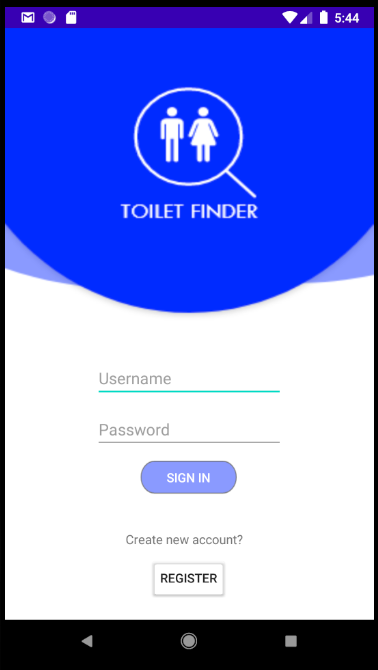
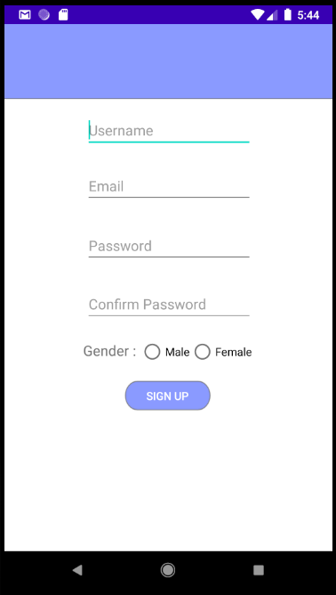

# T-INDER

## Nama kelompok dan anggota :
<table>
    <thead>
        <tr>
            <th></th>
            <th>Nama</th>
            <th>Nim</th>
        </tr>
    </thead>
    <tbody>
        <tr>
            <td>1</td>
            <td>Pascal Pribadi Akhmad P</td>
            <td>G64180022</td>
        </tr>
        <tr>
            <td>2</td>
            <td>Gerardo Keandre Lisrianto</td>
            <td>G64180049</td>
        </tr>
        <tr>
            <td>3</td>
            <td>Fathi Annaufal Soblia</td>
            <td>G64180094</td>
        </tr>
    </tbody>
</table>

## Latar belakang
Toilet umum merupakan salah satu fasilitas umum yang disediakan oleh IPB. Toilet umum disediakan di berbagai tempat di sekitar kampus.Namun, jam operasional toilet di kampus IPB sebagian besar tidak terinformasikan dengan baik. Toilet dengan jam operasional yang tidak diberitahukan sering kali membuat mahasiswa bingung. Mahasiswa yang ingin menggunakan toilet umum tetapi ternyata toilet umum tersebut tidak dibuka, harus pergi mencari toilet yang lain tanpa mengetahui ketersediaan penggunaan toilet umum yang lainnya. Oleh karena itu, mobile atau web aplikasi yang dapat mengetahui jam operasional dan ketersediaan toilet umum di kampus IPB dapat membantu mahasiswa untuk menemukan toilet yang tersedia.

## Tujuan
Aplikasi ini bertujuan untuk menginformasikan lokasi dan detail jam operasional untuk mengakses/menggunakan toilet umum di IPB.

## Ruang Lingkup

## Deskripsi Perangkat Lunak
Aplikasi mobile android untuk mencari lokasi toilet umum dan menginformasikan jam operasionalnya di kampus IPB. Detail aplikasi ini meliputi lokasi-lokasi toilet umum, jam operasional, ulasan dan rating dari pengguna.

## Analisis User
1. Pengguna dapat mengetahui posisi toilet
2. Pengguna dapat memberi rating
3. Pengguna dapat memberi review

## User Story
* Sebagai mahasiswa IPB, saya ingin mengetahui jam operasional dan detail dari toilet-toilet di IPB agar toilet yang saya kunjungi merupakan toilet yang sedang beroperasi pada waktunya

## Use Case Diagram

## Use Case Description

## Activity Diagram

## Gantt Chart

## ERD

# Hasil Implementasi Perangkat Lunak
## Halaman Login

## Halaman Register

## User Main Menu

## Admin Main Menu

## Tambah Toilet

## Terima request toilet (admin)

## Halaman isi review

## Halaman details 

## Halaman details (admin)

